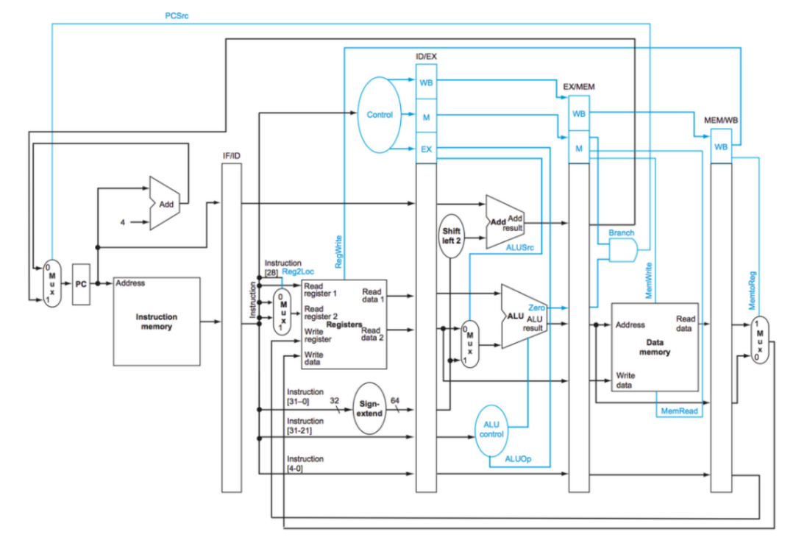

This is a pipelined ARM CPU that I designed using the follownig architecture:

Simulation Instructions:

To run this project, run the singlecyclecpu_tb.vhd script (use questasim ide) which has a clock unit and debug lines attached to the actual cpu.
Using this testbench file you can inspect the register files and dmemory.
